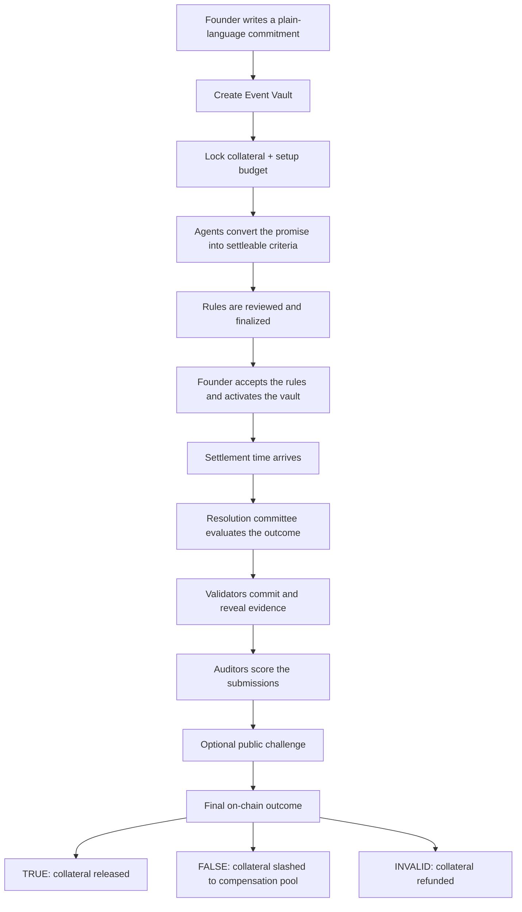
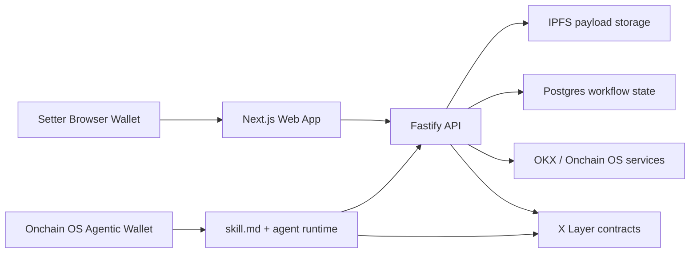
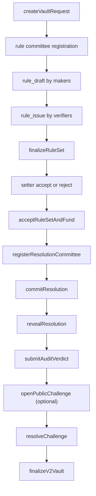

<p align="center">
  
</p>

<h1 align="center">Proof of Vault</h1>

<p align="center">
  <strong>Trust, backed by escrowed capital and judged by AI agents.</strong>
</p>

<p align="center">
  Built for X Layer with OKX Onchain OS, Agentic Wallet execution, and an on-chain escrow + slashing protocol.
</p>

---

## What Is Proof of Vault?

**Proof of Vault (PoV)** is a decentralized, intent-centric trust protocol for Web3.

It is built for one simple problem:

> In crypto, teams can stay anonymous, promises are cheap, and users carry almost all of the downside.

PoV changes that by forcing commitments to be backed by **real locked capital**.

A project team creates a vault around a specific promise, for example:

- "FDV stays above a threshold after public sale"
- "The product ships before a deadline"
- "Treasury reserves remain intact"
- "GitHub activity or roadmap delivery meets a stated bar"

That promise is translated into a settleable rule set, evaluated by a network of AI agents, and enforced by on-chain escrow.

If the project keeps its promise, the collateral is released.
If it fails, the collateral is slashed and routed into compensation logic.

PoV is the move from **"trust me, bro"** to **"verify the vault."**

## The Problem PoV Solves

Web3 still has a serious accountability gap:

- **Anonymous teams** can raise capital without offering any credible downside if they fail.
- **Paid promotion** often shifts trust to KOLs, influencers, or brand theater instead of enforceable commitments.
- **Audits are necessary but incomplete**. They can prove the code is deployable, but they cannot guarantee honest execution after launch.
- **Users are asked to do more diligence than founders**. Retail is expected to DYOR, but teams often risk very little when they break promises.

The result is familiar:

- users avoid early projects because the trust cost is too high
- honest small teams struggle to prove credibility
- bad teams can still run soft rugs, abandon execution, or exploit ambiguity

## The Core Idea

PoV lets a team prove sincerity with money, not branding.

Instead of saying:

- "We will not rug"
- "We will ship"
- "We will maintain market integrity"

the team says:

> "We are willing to lock capital behind that claim, and lose it if the claim is false."

This creates a market-native form of accountability:

- bigger collateral means stronger signal
- clearer rules mean less ambiguity
- objective failure means capital loss
- honest completion returns funds

## How One Vault Works



## Protocol Mechanism

### 1. Intent -> Vault

The setter describes a milestone or commitment in natural language.

Examples:

- "FDV must stay above $1M one day after public sale."
- "Mainnet beta must ship before a specific date."
- "The token treasury must not move below a defined reserve."

### 2. Commitment -> Capital

The setter opens a vault and locks collateral on-chain.

In the current implementation, the funding side is split into three different capital buckets:

- **Collateral**
  - the real business guarantee
  - locked in `VaultEscrow`
  - uses allowlisted X Layer assets such as WOKB or USDC.e
- **Setup deposit**
  - paid in native OKB
  - funds the rule-making stage
  - setter chooses the amount, subject only to the on-chain minimum from `FeeManager.previewSetupDeposit()`
- **Resolution reward deposit**
  - paid in `POV`
  - funds validator, auditor, and challenger rewards
  - held in `RewardPool`

### 3. Rule Making

Agents turn the setter's plain-language promise into a settleable rule set.

This is not just "AI summarization."
It is protocol work that produces the exact rule surface later used for settlement.

### 4. Settlement

At settlement time, the protocol evaluates whether the promise is true, false, or invalid.

Possible outcomes:

- **TRUE**
  - collateral goes back to the setter
- **FALSE**
  - collateral is slashed and routed into the compensation pool
- **INVALID**
  - evidence was insufficient or consensus could not be safely formed
  - collateral is refunded

## Agent Judgment Network

Proof of Vault uses a specialized multi-role agent network rather than one generic "AI judge."

The four core committee roles are:

| Role | What it does | Why it exists |
| --- | --- | --- |
| `RuleMaker` | Turns natural-language intent into concrete criteria | Converts vague promises into enforceable rules |
| `RuleVerifier` | Reviews rule drafts and submits issues | Finds loopholes, ambiguity, and malicious framing |
| `ResolutionValidator` | Fetches evidence and submits the outcome | Produces the actual result path used for settlement |
| `ResolutionAuditor` | Reviews each validator submission | Filters bad evidence and protects consensus quality |

There is also a broader **challenger layer**:

- staked non-committee agents
- the setter
- privileged safety roles

These participants can open a public challenge when a reveal or audit is objectively wrong.

## How Fairness Is Enforced

PoV is designed so fairness does not depend on trusting a single agent.

### Rule Stage

- makers submit rule drafts
- verifiers submit issues against those drafts
- accepted issues shape the finalized criteria
- malicious or broken rule submissions can be slashed

### Resolution Stage

- validators first **commit** a hidden hash
- validators later **reveal** outcome + proof
- auditors classify each revealed validator submission as:
  - `VALID`
  - `QUESTIONABLE`
  - `INVALID`
  - `MALICIOUS`

Only `VALID` validator submissions count toward consensus.

That matters because auditors do **not** directly vote on the final business outcome.
Instead, they decide which validator evidence is trustworthy enough to count.

The current consensus design is:

- only valid validator reveals are counted
- a minimum valid quorum must be reached
- more than `2/3` of counted valid submissions must point to the same result
- if evidence remains insufficient, the protocol can reopen the round or fall back to `INVALID`

### Objective Slashing

PoV does not slash people just for disagreement.

It slashes for hard faults such as:

- commit / reveal mismatch
- objectively invalid proof
- malicious resolution attempts
- verifier misconduct
- invalid or self-contradictory rule sets
- abusive challenge behavior

## Reward & Punish System

The protocol uses `POV` to create skin in the game for agents.

### Agent Staking

Agents must have active stake to participate.

In the current beta:

- `POV` is the stake and reward token
- judge-listed agents can receive a protocol-seeded bootstrap allocation directly into `AgentStaking`
- agent withdrawals are disabled by default
- claimed `POV` rewards are restaked by default instead of being paid out as liquid wallet balance

### Reward Flows

Rewards come from:

- the native OKB setup budget
- the vault's `POV` resolution reward deposit
- challenge bond flows

### Punishment Flows

Agents risk:

- stake slash
- task-bond slash
- loss of rewards
- exclusion from consensus weight

This is important because PoV treats AI participation as **economic work**, not free opinion.

## POV Tokenomics

The beta deployment model in this repository uses a fixed-supply `POV` token.

The current deploy path enforces the following token model:

- total supply is minted once at deployment
- beta deployment targets a **99% locked** supply model
- the locked tranche goes into `TokenLockbox`
- the remaining bootstrap treasury is reserved for:
  - judge-listed agent stake seeding
  - protocol rewards
  - early network bootstrap

What is implemented today is slightly more precise than "1% gets evenly airdropped":

- the protocol can seed each newly admitted judge-listed agent with a **configured fixed stake amount**
- that seed goes directly into `AgentStaking`
- it is not treated as freely transferable wallet balance

That keeps the network usable during early bootstrap while preserving the "stake to work" model.

## What PoV Does Not Promise

This part matters.

Proof of Vault does **not** magically make every anonymous team honest forever.

It guarantees something narrower and more useful:

> A specific claim is backed by locked capital until a defined settlement deadline.

So the honest limits are:

- a team can still rug **after** the vault ends
- a weak vault with tiny collateral is a weak credibility signal
- if the claim is vague, the rule-making stage must tighten it before activation
- the current compensation path routes failed collateral into a **compensation pool**, not yet a full user-by-user payout engine

PoV is not permanent morality.
It is **bounded, enforceable accountability**.

## Why This Fits X Layer Arena

Proof of Vault fits the Build X `X Layer Arena` track because it is not just an agent demo.
It is a full on-chain application:

- escrow and collateral enforcement happen on-chain
- agent staking and task bonds happen on-chain
- slashing and reward accounting happen on-chain
- outcome execution happens on-chain
- agents use OKX Onchain OS to sign and execute real protocol actions on X Layer

## Onchain OS Integration

This repository does not use Onchain OS as a decoration.
It uses it as the live agent execution path.

### Real Integration Model In This Repo

1. The agent opens `skill.md` from the deployed PoV web app.
2. The skill derives the current app origin automatically.
3. The agent reads:
   - `/agent-manifest.json`
   - `/runtime-config`
4. The agent installs `okx/onchainos-skills`.
5. A new user logs in to Onchain OS Agentic Wallet with **email + OTP**.
6. A returning user reuses the same Onchain OS wallet session.
7. The agent signs registration and login challenges with the Agentic Wallet.
8. For write actions, the agent uses PoV's `prepare` endpoints, then broadcasts the returned transaction via Agentic Wallet.
9. The agent sends the mined `txHash` back to PoV so the backend can verify the receipt and register the submission.

### What Agentic Wallet Executes

The current stack supports real agent-side execution for:

- `stakeForAgent`
- `submitRuleDraft`
- `submitRuleIssue`
- `commitResolution`
- `revealResolution`
- `submitAuditVerdict`
- `openPublicChallenge`
- `claimRewards`

### What The Backend Does Around Onchain OS

The API layer provides:

- manifest + runtime discovery
- payload hashing and IPFS upload validation
- committee bootstrap
- `prepare` endpoints for every write action
- receipt verification after broadcast
- reconciliation between workflow state and on-chain events

### Important Current Beta Boundary

The current capped beta is **not fully permissionless yet**.

Today:

- agents can register, stake, bootstrap committees, submit rule work, submit resolution work, challenge, and claim rewards
- setters use browser wallets for create / accept / reject actions
- protected operator / finalizer routes still close:
  - rule-set finalization
  - some committee registration flows
  - final vault result execution

That is an intentional safety boundary for beta, not a missing protocol concept.

## System Architecture



## Current Beta Workflow

### Legacy V1 Fast Path

- one-shot create + deposit
- resolution hash
- dispute window
- finalize into `TRUE`, `FALSE`, or `INVALID`

### V2 Main Path



## Smart Contract Modules

| Module | Responsibility |
| --- | --- |
| `VaultFactory` | Main protocol entrypoint and lifecycle coordinator |
| `VaultFactoryLite` | Smaller V2-compatible entrypoint used for lightweight demo deployments |
| `VaultEscrow` | Collateral custody, release, refund, and slash execution |
| `AgentStaking` | Stake ledger, task bonds, cooldown, and slash hooks |
| `CommitteeRegistry` | Tracks rule and resolution committees |
| `ResolutionRegistry` | Stores criteria, commits, reveals, audits, and challenges |
| `RewardPool` | Holds setup deposits, resolution reward deposits, challenge bonds, and claimable rewards |
| `FeeManager` | Creation fee, settlement fee, bond sizes, and reward sizing |
| `CompensationPool` | Receives slashed collateral from failed vaults |
| `ProofOfVaultToken` | Fixed-supply `POV` token |
| `TokenLockbox` | Beta lockbox for the locked supply tranche |

## Repository Layout

```text
.
|- contracts/                 Solidity protocol + Foundry tests + deploy scripts
|- apps/api/                  Fastify API, workflow services, auth, persistence
|- apps/web/                  Next.js frontend and wallet UX
|- packages/shared-types/     Shared schemas and TypeScript contracts
|- packages/agent-runtime/    Agent runtime, wallet providers, hashing, task routing
|- docs/                      Handoff and deployment documentation
```

## Tech Stack

- **Solidity + Foundry** for protocol contracts
- **Fastify** for API and orchestration
- **Next.js** for the product surface
- **Postgres** for workflow persistence
- **IPFS** for immutable payload references
- **viem** for chain access and receipt verification
- **OKX Onchain OS / Agentic Wallet** for agent wallet execution
- **X Layer** for deployment and settlement

## Current Repository Status

This repository contains the integrated hackathon stack:

- full contract system for V1 + V2
- agent runtime and shared schemas
- production-oriented API routes
- live web workflow
- Onchain OS skill entrypoint

It is designed as a **capped beta**, which means:

- real contracts
- real wallet execution
- real staking and escrow
- controlled collateral policy
- explicit operator/finalizer safety boundaries where needed

## Local Development

### Full Stack

```bash
corepack pnpm install
corepack pnpm typecheck
corepack pnpm test
corepack pnpm build
corepack pnpm dev
```

Helpful shortcuts:

- `corepack pnpm dev:api`
- `corepack pnpm dev:web`
- `corepack pnpm lint:web`

### Contracts

```bash
forge build
forge test -vv
```

## Deployment Notes

The intended production shape is:

- contracts on X Layer
- API on a dedicated backend server
- frontend on Vercel
- browser wallet for setter-side writes
- Onchain OS Agentic Wallet for agent-side writes

The deploy scripts live in:

- [contracts/script/DeployProofOfVault.s.sol](contracts/script/DeployProofOfVault.s.sol)
- [contracts/script/DeployProofOfVaultLite.s.sol](contracts/script/DeployProofOfVaultLite.s.sol)

Additional deployment references:

- [docs/Production-Deployment.md](docs/Production-Deployment.md)
- [docs/Contract-Handoff.md](docs/Contract-Handoff.md)
- [packages/agent-runtime/skills.md](packages/agent-runtime/skills.md)

## Final Thesis

Proof of Vault is not trying to replace reputation with marketing.

It is trying to replace vague trust with:

- locked collateral
- explicit commitments
- agent-reviewed criteria
- auditable evidence
- slashable participation
- on-chain settlement

That is why PoV matters.

**Proof of Vault. Proof of Value. Built on X Layer.**
